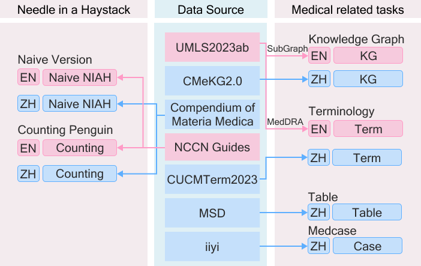
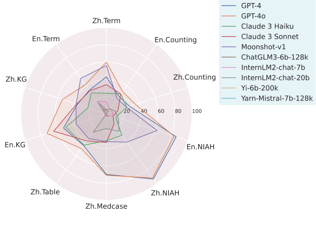
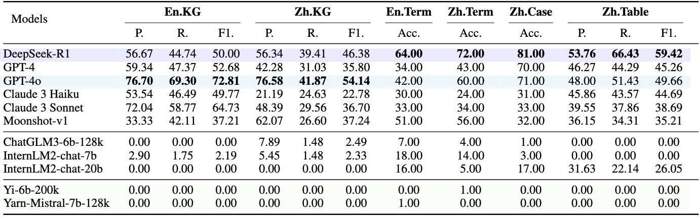
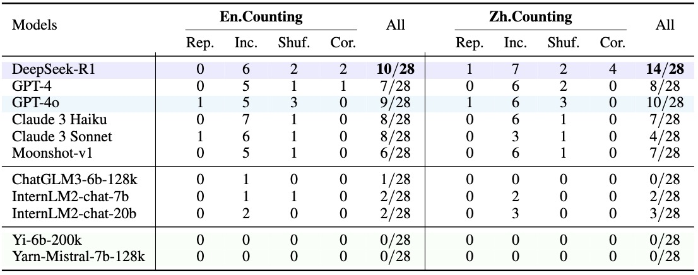
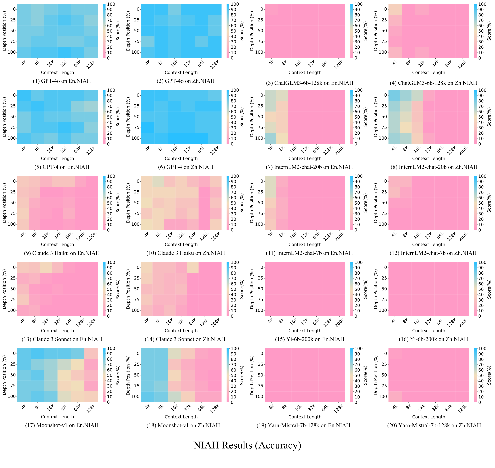
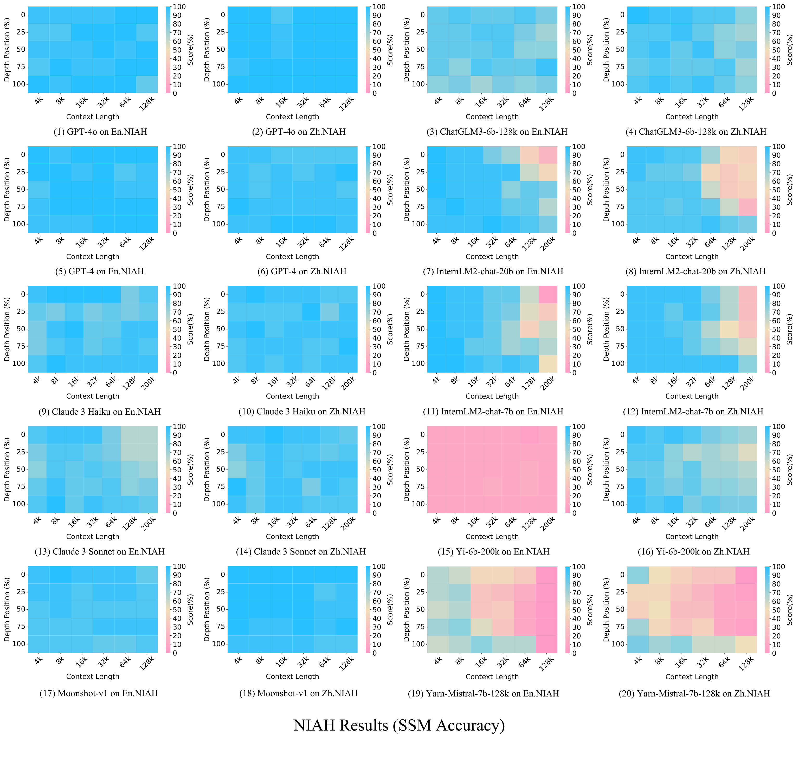

# MedOdyssey: A Medical Domain Benchmark for Long Context Evaluation Up to 200K Tokens

## Introduction

Welcome to MedOdyssey, a medical long-context benchmark with seven length levels ranging from 4K to 200K tokens. MedOdyssey consists of two primary components: the medical-context "Needles in a Haystack'' task and a series of tasks specific to medical applications, together comprising 10 datasets. Here is the Architecture of MedOdyssey.
<div align="center">
  
</div>

## Dataset Statistics
| Task         | Annotation    | # Examples        | Avg. Len     | MIC | NFI | CIR | Eval Metrics  |
|--------------|---------------|-------------------|--------------|-----|-----|-----|---------------|
| En.NIAH      | Auto & Human  | 20×7×5            | 179.2k/32    | ✔   | ✔   | ✘   | Acc.          |
| Zh.NIAH      | Auto & Human  | 20×7×5            | 45.6k/10.2   | ✔   | ✔   | ✘   | Acc.          |
| En.Counting  | Auto          | 4×7               | 179.0k/13.6  | ✔   | ✘   | ✔   | Acc.          |
| Zh.Counting  | Auto          | 4×7               | 45.6k/12.3   | ✔   | ✘   | ✔   | Acc.          |
| En.KG        | Auto & Human  | 100               | 186.4k/68.8  | ✔   | ✘   | ✔   | P., R., F1.   |
| Zh.KG        | Auto & Human  | 100               | 42.5k/2.0    | ✔   | ✘   | ✔   | P., R., F1.   |
| En.Term      | Auto          | 100               | 183.1k/11.7  | ✔   | ✘   | ✘   | Acc.          |
| Zh.Term      | Auto          | 100               | 32.6k/7.0    | ✔   | ✘   | ✘   | Acc.          |
| Zh.Case      | Auto & Human  | 100               | 47.7k/1.3    | ✔   | ✘   | ✘   | Acc.          |
| Zh.Table     | Auto & Human  | 100               | 53.6k/1.4    | ✔   | ✘   | ✘   | P., R., F1.   |

Here are the dataset statistics, where "MIC" is short for **M**aximum **I**dentical **C**ontext, "NFI" is short for **N**ovel **F**acts **I**njection, and "CIR" is short for **C**ounter-**i**ntuitive **R**easoning.

## Baselines
We researched current state-of-the-art long-context LLMs and presented the performance of two kinds of baseline LLMs in MedOdyssey. For closed-source commercial LLMs, we call the official APIs to get the responses for each task. We also deployed open-source models for inference on our own. The LLMs and versions we selected are as follows:

- **DeepSeek-R1**: Released in 
January 2025, DeepSeek-R1-Zero represents a pure RL approach without relying on cold-start
data, achieving strong performance across various tasks. DeepSeek-R1 is more powerful,
leveraging cold-start data alongside iterative RL fine-tuning. (deepseek-reasoner 2025-01-20)

- **GPT-4**: Released in March 2023, GPT-4 is a state-of-the-art language model developed by OpenAI. It supports a context window length of 8,192 tokens, which was extended to 128k in the November 2023 update. (gpt-4-turbo-2024-04-09)

- **GPT-4o**: An optimized variant of GPT-4, GPT-4o was introduced in May 2024, has a 128k context window, and has a knowledge cut-off date of October 2023. (gpt-4o-2024-05-13)

- **Claude 3**: Launched by Anthropic in March 2024, the family includes three models in ascending order of capability: Haiku, Sonnet, and Opus, allowing users to select. The three models offer a 200k context window upon launch. (claude-3-haiku-20240307 and claude-3-sonnet-20240229)

- **Moonshot-v1**: Released in 2023 by Moonshot AI, it emphasizes scalability and supports a context window of 128k tokens for generating very long texts. (moonshot-v1-128k)

- **ChatGLM3-6b-128k**: Developed by ZHIPU·AI in 2024, it builds based on ChatGLM3-6B and better handles long contexts up to 128K tokens.

- **InternLM2**: An open-source LLM is introduced in 2024 by Shanghai AI Lab, including 7b and 20b sizes. It initially trained on 4k tokens before advancing to 32k tokens in pre-training and fine-tuning stages, and has officially supported 200k inference technology.

- **Yi-6b-200k**: Yi series models are the next generation of open-source large language models trained from scratch by 01.AI and the 6B version is open-sourced and available to the public in November 2023 and supports a context window length of 200k.

- **Yarn-Mistral-7b-128k**: Developed by NousResearch and released in November 2023. It is further pre-trained on long context data for 1500 steps using the YaRN extension method based on Mistral-7B-v0.1 and supports a 128k token context window.

## Overall Evaluation Results
<div align="center">
  
</div>

## Main Results of Medical-related Tasks
<div align="center">
  
</div>

## Main Results of Needles in a Haystack
Notes: The default is the exact string-matching strategy and SSM is the subset string-matching strategy.
<div align="center">
  
</div>
<div align="center">
  
</div>
<div align="center">
  
</div>

## Citation
Thank you for your interest, if you use this project, please give us a 🌟 and cite the following paper:

```bibtex 
@inproceedings{fan-etal-2025-medodyssey,
    title = "{M}ed{O}dyssey: A Medical Domain Benchmark for Long Context Evaluation Up to 200{K} Tokens",
    author = "Fan, Yongqi  and
      Sun, Hongli  and
      Xue, Kui  and
      Zhang, Xiaofan  and
      Zhang, Shaoting  and
      Ruan, Tong",
    editor = "Chiruzzo, Luis  and
      Ritter, Alan  and
      Wang, Lu",
    booktitle = "Findings of the Association for Computational Linguistics: NAACL 2025",
    month = apr,
    year = "2025",
    address = "Albuquerque, New Mexico",
    publisher = "Association for Computational Linguistics",
    url = "https://aclanthology.org/2025.findings-naacl.3/",
    pages = "32--56",
    ISBN = "979-8-89176-195-7",
    abstract = "Numerous advanced Large Language Models (LLMs) now support context lengths up to 128K, and some extend to 200K. Some benchmarks in the generic domain have also followed up on evaluating long-context capabilities. In the medical domain, tasks are distinctive due to the unique contexts and need for domain expertise, necessitating further evaluation. However, despite the frequent presence of long texts in medical scenarios, evaluation benchmarks of long-context capabilities for LLMs in this field are still rare. In this paper, we propose MedOdyssey, the first medical long-context benchmark with seven length levels ranging from 4K to 200K tokens. MedOdyssey consists of two primary components: the medical-context {\textquotedblleft}needles in a haystack{\textquotedblright} task and a series of tasks specific to medical applications, together comprising 10 datasets. The first component includes challenges such as counter-intuitive reasoning and novel (unknown) facts injection to mitigate knowledge leakage and data contamination of LLMs. The second component confronts the challenge of requiring professional medical expertise. Especially, we design the {\textquoteleft}{\textquotedblleft}Maximum Identical Context{\textquotedblright} principle to improve fairness by guaranteeing that different LLMs observe as many identical contexts as possible. Our experiment evaluates advanced proprietary and open-source LLMs tailored for processing long contexts and presents detailed performance analyses. This highlights that LLMs still face challenges and need for further research in this area. Our code and data are released in the repository: \url{https://github.com/JOHNNY-fans/MedOdyssey}."
}