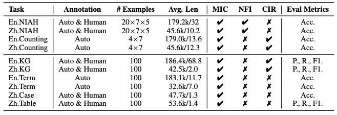

# MedOdyssey: A Medical Domain Benchmark for Long Context Evaluation Up to 200K Tokens

## Introduction

Welcome to MedOdyssey, a medical long-context benchmark with seven length levels ranging from 4K to 200K tokens. MedOdyssey consists of two primary components: the medical-context "Needles in a Haystack'' task and a series of tasks specific to medical applications, together comprising 10 datasets. Here is the Architecture of MedOdyssey.

  

## Dataset Statistics. 

  

Here are the dataset statistics, where "MIC" is short for **M**aximum **I**dentical **C**ontext, "NFI" is short for **N**ovel **F**acts **I**njection, and "CIR" is short for **C**ounter-**i**ntuitive **R**easoning.

## Baselines
We researched current state-of-the-art long-context LLMs and presented the performance of two kinds of baseline LLMs in MedOdyssey. For closed-source commercial LLMs, we call the official APIs to get the responses for each task. We also deployed open-source models for inference on our own. The LLMs and versions we selected are as follows:

- **GPT-4**: Released in March 2023, GPT-4 is a state-of-the-art language model developed by OpenAI. It supports a context window length of 8,192 tokens, which was extended to 128k in the November 2023 update. (gpt-4-turbo-2024-04-09)

- **GPT-4o**: An optimized variant of GPT-4, GPT-4o was introduced in May 2024, has a 128k context window, and has a knowledge cut-off date of October 2023. (gpt-4o-2024-05-13)

- **Claude 3**: Launched by Anthropic in March 2024, the family includes three models in ascending order of capability: Haiku, Sonnet, and Opus, allowing users to select. The three models offer a 200k context window upon launch. (claude-3-haiku-20240307 and claude-3-sonnet-20240229)

- **Moonshot-v1**: Released in 2023 by Moonshot AI, it emphasizes scalability and supports a context window of 128k tokens for generating very long texts. (moonshot-v1-128k)

- **ChatGLM3-6b-128k**: Developed by ZHIPU·AI in 2024, it builds based on ChatGLM3-6B and better handles long contexts up to 128K tokens.

- **InternLM2**: An open-source LLM is introduced in 2024 by Shanghai AI Lab, including 7b and 20b sizes. It initially trained on 4k tokens before advancing to 32k tokens in pre-training and fine-tuning stages, and has officially supported 200k inference technology.

- **Yi-6b-200k**: Yi series models are the next generation of open-source large language models trained from scratch by 01.AI and the 6B version is open-sourced and available to the public in November 2023 and supports a context window length of 200k.

- **Yarn-Mistral-7b-128k**: Developed by NousResearch and released in November 2023. It is further pre-trained on long context data for 1500 steps using the YaRN extension method based on Mistral-7B-v0.1 and supports a 128k token context window.

## Overall Evaluation Results. 

  

## Main Results of Needles in a Haystack. 
Notes: The default is the exact string-matching strategy and SSM is the subset string-matching strategy.

  

  

